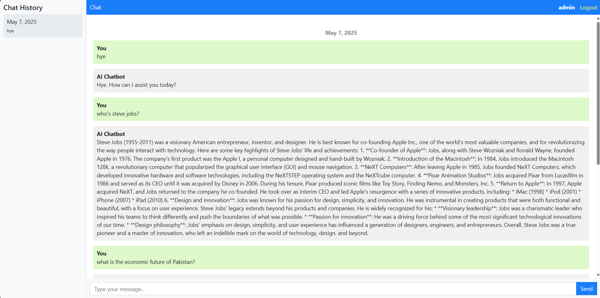

# Django Chatbot 💬

A web-based AI chatbot built with Django and integrated with the Groq API (LLaMA 3.3 70B Versatile). This chatbot supports user authentication, multi-session conversations, and a clean chat UI with history tracking.

---

## 🚀 Features

- 🔐 User Registration and Login
- 💬 Persistent Chat Sessions
- 🧠 AI Responses using Groq’s LLaMA-3.3-70B model
- 🗃️ Sidebar Chat History
- 🧭 Session Switching and Preview
- 📅 Chats grouped by session and timestamped

---

## 🖼️ UI Highlights

- Sidebar on the left showing recent sessions
- Main chat panel on the right
- Fixed message input bar at the bottom
- AI and user messages styled differently for clarity
- Logout and authentication links integrated in the header

---

## 🛠️ Tech Stack

| Layer        | Technology                |
|--------------|----------------------------|
| Frontend     | HTML, CSS, Bootstrap       |
| Backend      | Python, Django             |
| AI API       | Groq (LLaMA-3.3-70B)       |
| Database     | SQLite (default for dev)   |
| Auth         | Django’s Built-in Auth     |

---

## 📷 ScreenShots



---

## 📂 Project Structure

```
chatbot/
├── chatapp/
│   ├── migrations/
│   ├── static/
│   ├── templates/
│   ├── admin.py
│   ├── models.py
│   ├── views.py
│   ├── urls.py
├── chatbot/
│   ├── settings.py
│   ├── urls.py
├── db.sqlite3
├── manage.py
```

---

## 📦 Setup & Deployment

### 1. Clone the repository

```bash
git clone https://github.com/TheMuazAshraf/Django-chatbot.git
cd Django-chatbot
```

### 2. Create a virtual environment

```bash
python -m venv venv
source venv/bin/activate  # On Windows: venv\Scripts\activate
```

### 3. Install dependencies

```bash
pip install -r requirements.txt
```

> If you don’t have a `requirements.txt`, run `pip freeze > requirements.txt` to generate one.

### 4. Add your Groq API key

Edit the `views.py` file:

```python
client = Groq(api_key="your_groq_api_key", base_url="https://api.groq.com")
```

Replace `"your_groq_api_key"` with your actual API key.

### 5. Apply migrations

```bash
python manage.py makemigrations
python manage.py migrate
```

### 6. Create a superuser (optional)

```bash
python manage.py createsuperuser
```

### 7. Run the server

```bash
python manage.py runserver
```

Access the app at `http://127.0.0.1:8000/`.

---

## 📜 License

This project is licensed under the MIT License.  
You are free to use, modify, and distribute this project for personal and commercial use.  
See the full license [here](https://opensource.org/licenses/MIT).

---

## 🙋‍♂️ Author

**Muaz Ashraf**  
🔗 [LinkedIn](https://www.linkedin.com/in/themuazashraf)  
💻 [GitHub](https://github.com/TheMuazAshraf)
